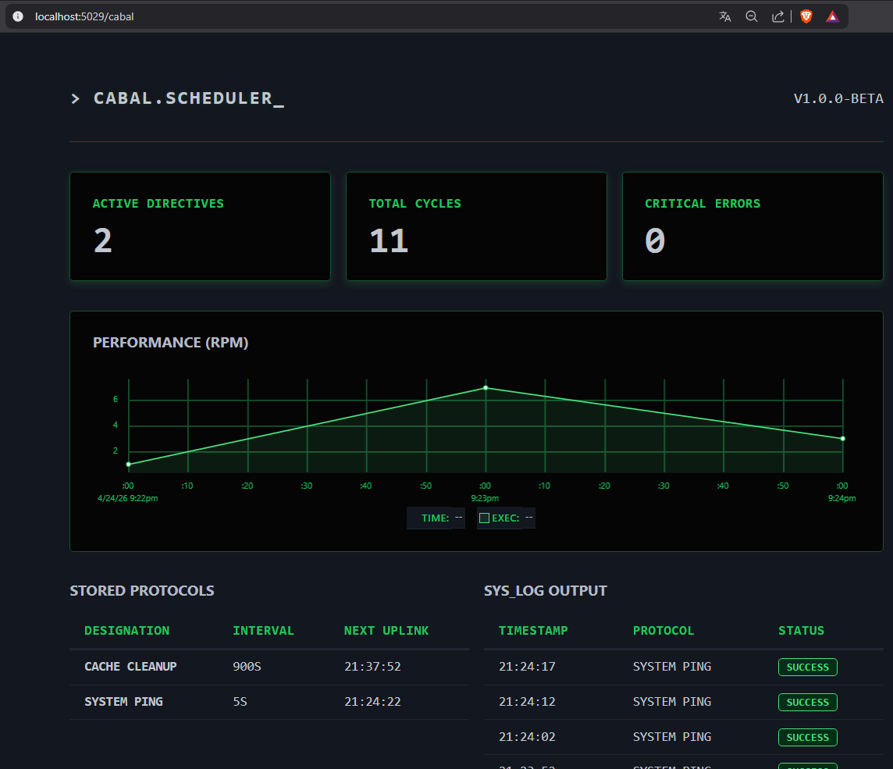

# Cabal Scheduler

A lightweight background job engine for .NET 8. No Redis, no ORMs, no bloat.

Sometimes you just need to run a task every few minutes and know when it crashes.
Hangfire and Quartz are great tools, but they come with real setup costs — infrastructure dependencies, large schemas, learning curves. Cabal is for the cases where all of that is too much.

---

## Features

- **Zero external dependencies** in the core package. The only reference is `Microsoft.AspNetCore.App`.
- **Raw ADO.NET** against SQLite. No ORM, no reflection magic.
- **Concurrency-safe** by default. Uses WAL mode and an atomic `UPDATE … RETURNING` lock, so running multiple instances of your app won't cause duplicate executions.
- **Retry with exponential backoff.** Configure max retries per job; failures are caught, logged and recorded to the database.
- **Built-in dashboard** at any path you choose. No external assets, the HTML is embedded in the binary.

---

## Installation

(soon 😉)
```
dotnet add package Cabal.Scheduler
dotnet add package Cabal.SQLite
```

---

## Quick start

```csharp
// Program.cs
using Cabal.Scheduler;
using Cabal.Scheduler.Builder;
using Cabal.SQLite;

var builder = WebApplication.CreateBuilder(args);

// 1. Register Cabal with SQLite storage
builder.Services.AddCabalSqlite("Data Source=cabal.db;");

// 2. Define your jobs
Schedule.Every(5).Seconds()
        .WithName("System Ping")
        .Do(() => Console.WriteLine("Ping!"));

Schedule.Every(1).Days()
        .WithName("DB Backup")
        .WithRetries(3)
        .Do(async () => await RunBackupAsync());

var app = builder.Build();

// 3. Mount the dashboard
app.UseCabalDashboard("/cabal");

app.Run();
```

---

## Dashboard

Navigate to `/cabal` (or whatever path you configured) to see active jobs, next execution times, execution history and an RPM graph for the last hour.
<p align="center">
  
</p>
---

## Scoped services

Each job execution gets its own DI scope, so you can safely inject scoped services like a `DbContext`:

```csharp
Schedule.Every(10).Minutes()
        .WithName("Send Pending Emails")
        .Do(async (services, ct) =>
        {
            var db = services.GetRequiredService<AppDbContext>();
            // ...
        });
```

---

## License

MIT
