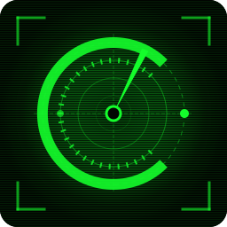
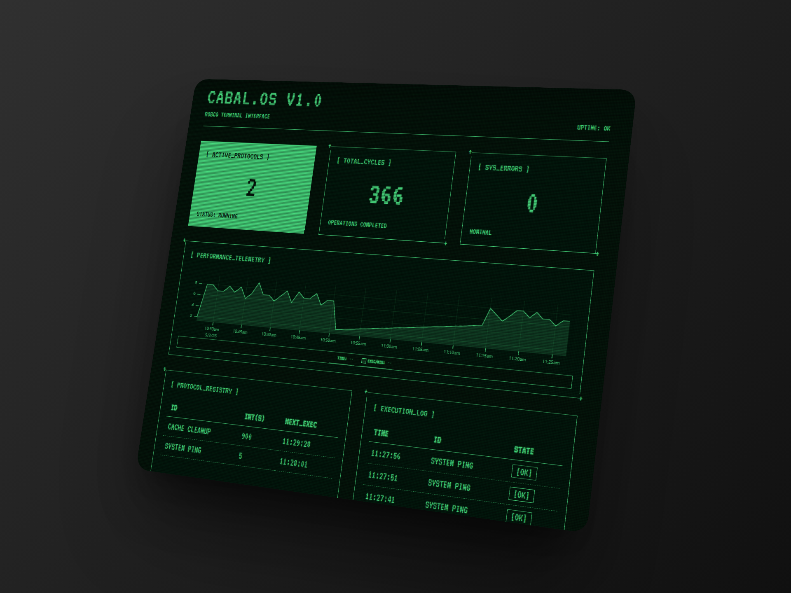

<p align="center">
  
</p>

# Cabal Scheduler
A lightweight background job engine for .NET 8. No Redis, no ORMs, no bloat.

Sometimes you just need to run a task every few minutes and know if it crashes. Hangfire and Quartz are great tools, but they come with real setup costs — infrastructure dependencies, massive schemas, learning curves. Cabal is built for the cases where all of that is simply overkill.

---

## 🪶 Package Size & Footprint

Cabal is expressly designed to be ultra-lightweight and is fully compatible with **Trimmed** and **Native AOT** Self-Contained deployments.

| Package | NuGet (`.nupkg`) | Binary (`.dll`) |
|---|---|---|
| **Cabal.Scheduler (Core)** | ~23.5 KB | ~71.5 KB |
| **Cabal.SQLite** | ~13.4 KB | ~33.5 KB |
| **Cabal.PostgreSQL** | ~13.5 KB | ~34.0 KB |

**Total payload:** The engine plus a database driver will add just around **~105 KB** to your final binary.

---

## ⚡ Features

- **Zero external dependencies** in the core package. The only reference is `Microsoft.AspNetCore.App`.
- **Trim-Compatible.** Fully annotated for AOT and trimming. No reflection used in the core execution engine.
- **Raw ADO.NET** against SQLite or PostgreSQL. No ORM overhead.
- **Concurrency-safe.** SQLite uses WAL mode and atomic `UPDATE … RETURNING`. PostgreSQL uses `FOR UPDATE SKIP LOCKED` for native row-level locking.
- **Batch Processing.** Heavily optimized for high-throughput environments.
- **Concurrency Limits.** Protects your `ThreadPool` and database connection pools via strict `SemaphoreSlim` limiting.
- **Exponential Backoff.** Configure max retries per job.
- **Built-in Dashboard.** Embedded directly in the binary—no external static assets to host.

---

## 📊 Benchmarks

Cabal is heavily optimized to reduce garbage collection pressure. Compared to industry standards, Cabal operates with significantly fewer memory allocations, effectively eradicating `N+1` query problems and utilizing a zero-allocation task state machine.

**Job Scheduling Overhead (1000 Jobs)**

| Library | Mean Time | Allocated Memory | Alloc Ratio |
|---|---|---|---|
| **Cabal (SQLite In-Memory)** | 11.75 ms | **2.46 MB** | **1.00x** |
| **Cabal (PostgreSQL Local)** | 28.25 ms | **3.18 MB** | 1.29x |
| **Quartz (MemoryStorage)** | 3.46 ms | 5.93 MB | 2.41x |
| **Hangfire (MemoryStorage)** | 118.69 ms | 68.30 MB | 27.76x |

*(Note: Quartz uses in-memory buffering for faster raw times, whereas Cabal guarantees immediate atomic persistence to disk. Cabal's PostgreSQL test includes network latency, but notice how Cabal strictly maintains an extremely low memory footprint compared to Hangfire).*

**Job Execution & State Machine**

During job dispatching, Cabal fetches jobs in batches using `RETURNING` clauses (avoiding secondary `GetJobById` lookups) and coordinates parallelism purely via `SemaphoreSlim` capacity. This allows Cabal to scale to thousands of concurrent background jobs without maintaining heavy blocking collections (`List<Task>`) or producing `ContinueWith` closure allocations, resulting in **zero-allocation** graceful shutdowns.

### When to use Hangfire Instead (Fire-and-Forget Queues)

Cabal is strictly a **Scheduler**. It is designed to run *recurring* background tasks reliably. Every execution involves calculating the next interval, updating the database record atomically, and writing an execution history log. 

If your use case involves blasting thousands of **Fire-and-Forget** messages into a queue where you don't need recurrence or strict execution history, **Hangfire** (with memory/Redis storage) or **RabbitMQ** are much better suited tools.

**Fire-and-Forget Burst (10,000 Jobs)**

| Library | Scenario Type | Mean Time |
|---|---|---|
| **Hangfire (MemoryStorage)** | In-Memory Message Queue | **~0.38 s** |
| **Cabal (SQLite In-Memory)** | Forced Database Transactions | ~20.96 s |

*(Note: Hangfire processes this load exponentially faster because `BackgroundJob.Enqueue` acts as a pure in-memory `ConcurrentQueue` loop, while Cabal performs 10,000 atomic database roundtrips to lock, execute, and write history logs for each job).*

---

## 📦 Installation

*(Coming soon to NuGet 😉)*
```bash
dotnet add package Cabal.Scheduler
```
Then, choose your storage provider:
```bash
dotnet add package Cabal.SQLite
# or
dotnet add package Cabal.PostgreSQL
```

---

## 🔌 How to Integrate

Integrating Cabal takes only **3 simple steps** in your `Program.cs`. 

### Step 1: Register Storage
Pick your preferred database engine. Cabal will automatically create and migrate the required lightweight tables on startup.

**For SQLite:**
```csharp
builder.Services.AddCabalSqlite("Data Source=cabal.db;");
```

**For PostgreSQL:**
```csharp
builder.Services.AddCabalPostgreSql("Host=localhost;Database=cabal;Username=user;Password=pass;");
```

### Step 2: Define your Jobs
Jobs are strongly typed and defined via a fluent API. You have access to the service provider, meaning you can easily resolve scoped services (like your Entity Framework `DbContext`) inside the delegate.

```csharp
// Simple Action
Schedule.Every(5).Seconds()
        .WithName("System Ping")
        .Do(() => Console.WriteLine("Ping!"));

// Async Action with Dependency Injection
Schedule.Every(10).Minutes()
        .WithName("Send Pending Emails")
        .WithRetries(3)
        .Do(async (services, ct) =>
        {
            var db = services.GetRequiredService<AppDbContext>();
            await EmailService.ProcessQueueAsync(db, ct);
        });
```

### Step 3: Mount the Dashboard (Optional)
Cabal comes with an embedded, post-apocalyptic terminal-themed dashboard. Just pick a route!

```csharp
var app = builder.Build();

// Mount the UI at /cabal
app.UseCabalDashboard("/cabal");

app.Run();
```

> **Tip:** Use the `compose.yaml` file in this repo to easily spin up a PostgreSQL instance for local development:
> ```bash
> docker compose up -d
> ```

---

## 🖥️ Dashboard View

Navigate to your mounted path (e.g., `/cabal`) to monitor active jobs, check upcoming execution times, view history logs, and see an RPM graph.

<p align="center">
  
</p>

---

## 📄 License

MIT
